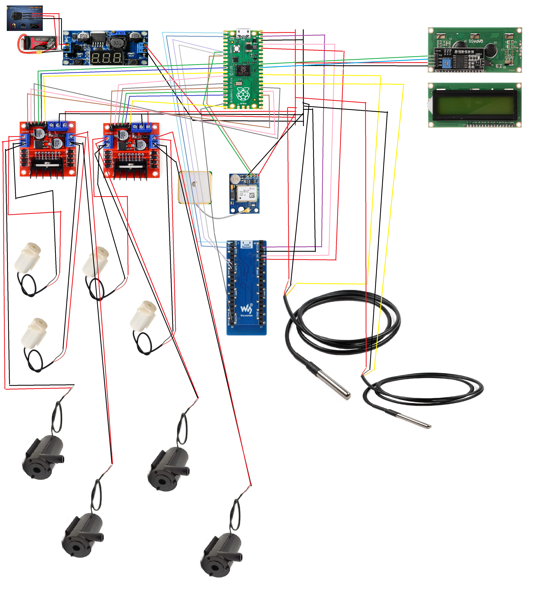

# Automated Robotic Water Probe and Android Wireless Controller
## Abstract
This project is educational and is aimed at constructing a robotic device capable of communicating wirelessly to an android device in which its orchestrating allows for the exchange of data and commands. This Robotic device must be able to work autonomously following a reactive robotics design. The product of our robotic design contains many modes of motion some reactive, some pseudo random, some hybrid and one dependent on triangulation from a GPS module. 
The Android application was written to communicate and manage the device remotely. 
Video test 1 | Video test 2
:-: | :-:
[](https://youtube.com/shorts/DA3VpMYrh54)|[](https://youtu.be/TfpH4z4nkwI)

## Android Controls
We decided early in the project that our robot needed to react not only according to its environment but also respond to our command directly. Another important feature the android app add to the robot is instantaneous remote monitoring of the device. Some encoded features that allowed us to trouble shoot were also added. Passive trouble shooting was done through the use of messages and light flashing patterns. active trouble shooting features allowed us to send commands to terminate, initialize and recall any methods currently running. 

## Future work
One of the ideas not accomplished due to time constraints was to use the android application as a bridge to an AWS account to persist as well as process data. This would allow for more complex operations and the use of ML to infuse the device motion with insight from data processing that would be computationally expensive locally. I believe it would be more enlightening to work on a server or maybe using an opensource personal cloud environment because it would allow for deeper understanding of lower-level concepts in cloud technologies. 
Besides the memory processing that I mentioned I would also like to use the concepts brought by Braitenberg from vehicle 13 described in his book Vehicles. He describes the use of a short memory and the use of thresholds to avoid overloading. 
- My idea would be to use 3 levels of strictly defined size memories which could be easily implemented as a three-dimensional array. 
- The first layer would record data sequentially from first to last, at the last input it would calculate the midpoint between the mean and the median and record it in the second level first input. 
- The first level would again start from start to end overwriting its earlier entries one at the time and at the end again calculating from its previous entries the now second entry to the second layer. 
- The second layer would be filled and mimic the first layer by initializing the third layer which would act exactly like the second. 

More layers could be added in the same manner. My intention is to build a land vehicle, a much easier task than the one we build for this project and implement this concept. 
The choice between the mean and the median stands for the idea of risk taking or moderate reaction, or some would say, the difference between the pragmatic and the dreamer. The median would be less affected by extremes and not react impulsively because of them. While the mean would be affected by outliers and be slightly attracted towards them or more strongly repulsed by them. I like to think that this is associated with playing the lottery; people that only play the lottery moderately are median driven, they are not pulled by the chance of winning as much as the mean driven people; the mean driven people are more attracted to taking the risk regardless of the reduced chance, the greater the reward.  
    
### Android Confirguration Problems 
##### if you device is old and the JDK is not compatible try this
- If the phone app does not load because of older phone apk modify this file
```java
defaultConfig {
    applicationId "com.example.test.myapplication"
    minSdkVersion 15
    targetSdkVersion 'L' //change this to 19
    versionCode 1
    versionName "1.0"
}
```
- This file is located in build.gradle

# Wiring Diagram


 